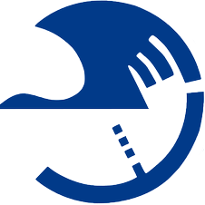
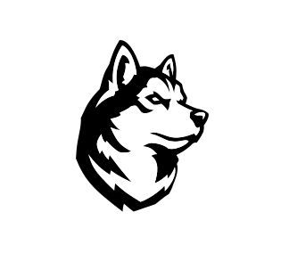

Hi! I’m Shan Jiang [江](https://en.wikipedia.org/wiki/Ji%C4%81ng_(surname_%E6%B1%9F))[山](https://en.wikipedia.org/wiki/Radical_46) (he/him). I’m currently a 5th-year Ph.D. student at  [Northeastern University](https://www.northeastern.edu), *happily* advised by  [Christo Wilson](https://cbw.sh). I will join  [Facebook](https://engineering.fb.com) as a Research Scientist in 2021.

My Ph.D. research seeks to measure the **(mis)information** ecosystem by observing the behaviors of its players, such as understanding audiences’ responses to “fake news” on social media \[ [CSCW’18a](publications/cscw18a_paper.pdf), [ICWSM’20](publications/icwsm20_paper.pdf) \] and auditing ideological bias in platforms’ intervention practices, *e.g.*, moderating content \[ [ICWSM’19](publications/icwsm19_paper.pdf), [AAAI’20](publications/aaai20_paper.pdf) \], generating search snippets \[ [WWW’19](publications/www19_paper.pdf) \], ranking search results \[ [CSCW’18b](publications/cscw18b_paper.pdf) \].

More broadly, my research interests revolve around **AI/ML methods** and **social problems**. During Ph.D., I have spent some time at  [Google AI](https://ai.google) on extracting structured information from fact-checks \[ [WWW’20](publications/www20_paper.pdf) \], at  [Dataminr](https://www.dataminr.com) on detecting crisis events \[ [AISG’19](publications/aisg19_paper.pdf) \], and at  [Facebook](https://engineering.fb.com) on detecting illicit trades.

Before Ph.D., I received my B.B.A. in Management Information Systems from  [Beijing University of Posts and Telecommunications](https://english.bupt.edu.cn) and did my undergrad thesis at  [National University of Singapore](http://www.nus.edu.sg).

More of my work can be found in my [publications](publications),  [Google Scholar](https://scholar.google.com/citations?user=0LITOxAAAAAJ),  [GitHub](https://github.com/printfoo), or  [curriculum vitae](shanjiang-cv.pdf).

I’m available at  [sjiang@ccs.neu.edu](mailto:sjiang@ccs.neu.edu).

<!--

\[  [sjiang@ccs.neu.edu](mailto:sjiang@ccs.neu.edu) \|  [CV](shanjiang-cv.pdf) \|  [Google Scholar](https://scholar.google.com/citations?user=0LITOxAAAAAJ) \|  [dblp](https://dblp.org/pid/04/2910-8.html) \|  [GitHub](https://github.com/printfoo) \|  [LinkedIn](https://www.linkedin.com/in/shan-jiang) \]

### Education
*  [Northeastern](https://www.northeastern.edu), Ph.D. in Computer Science, advised by  [Christo Wilson](https://cbw.sh), expected 2021
*  [BUPT](https://english.bupt.edu.cn), B.B.A. in Management Information Systems, 2016

### Experience
*  [Northeastern](https://www.northeastern.edu), Research Assistant, 2016 - now
*  [Facebook (Integrity)](https://ai.facebook.com), Ph.D. ML Intern, 2020
*  [Google (Research)](https://ai.google), Ph.D. SWE Intern, 2019
*  [Dataminr (AI & DS)](https://www.dataminr.com), Research Intern, 2019
*  [NUS](http://www.nus.edu.sg), Research Assistant, 2015 - 2016
*  [BUPT](https://english.bupt.edu.cn), Research Assistant, 2013 - 2015

### News
* 2020-09-04: Finished my summer internship (remotely) with [Facebook](https://research.fb.com). Had a wonderful time thanks to the illicit trade team!
* 2020-05-31: The [video](https://youtu.be/ZHY1hzJ_F9o) for the (mis)info and (dis)belief paper at [ICWSM’20](https://www.icwsm.org/2020/index.html) is uploaded on YouTube.
* 2020-04-07: The [video](https://youtu.be/9Kp9GdItRjs) for the factoring fact-check paper at [WWW’20](https://www2020.thewebconf.org) is uploaded on YouTube.
* 2020-03-17: (Mis)info and (dis)belief paper is accepted at [ICWSM’20](https://www.icwsm.org/2020). Thanks to my collaborators [Miriam](https://www.comm.ucsb.edu/people/miriam-metzger) and [Andrew](https://www.comm.ucsb.edu/people/andrew-flanagin) from UCSB!
* 2020-01-10: Factoring fact-check paper (done during the summer internship with Google Research) is accepted at [WWW’20](https://www2020.thewebconf.org). Thanks to [Simon](https://ai.google/research/people/105996), [Abe](https://scholar.google.com/citations?user=8P1Y_90AAAAJ) and [Cong](https://sites.google.com/site/congyu) from the fact-check team!
* 2019-10-08: Content moderation paper is invited as a sister conference track [paper](publications/aaai20_paper.pdf) at [AAAI’20](https://aaai.org/Conferences/AAAI-20).
* 2019-08-30: Finished my summer internship with [Google Research](https://ai.google). Had a wonderful time thanks to the entire NY structured data team!
* 2019-06-11: Content moderation [paper](publications/icwsm19_paper.pdf) win an Outstanding Analysis Paper award at [ICWSM’19](https://www.icwsm.org/2019). Thanks to my collaborator [Ron](http://ronalderobertson.com)!

(Thanks to my advisor  [Christo](https://cbw.sh) are implicitly embedded in everything above!)
-->
