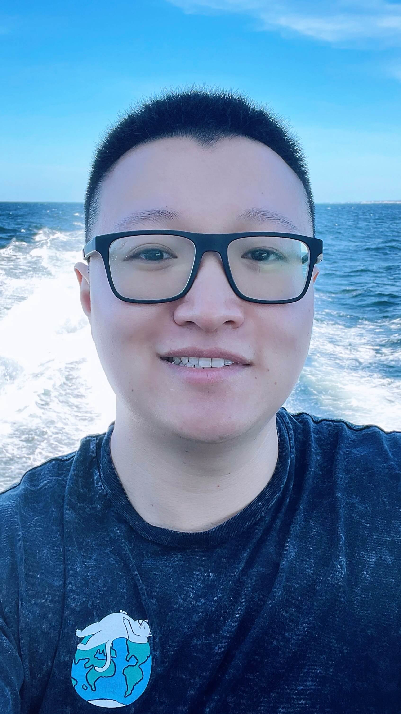

    
    <figcaption>
        
        <a href="https://scholar.google.com/citations?user=0LITOxAAAAAJ">Google Scholar</a>
    </figcaption>
    <figcaption>
        
        <a href="shanjiang-cv.pdf">Curriculum Vitae</a>
    </figcaption>
    <figcaption>
        
        <a href="mailto:shanj@fb.com">shanj@fb.com</a>
    </figcaption>

Hi! I’m Shan Jiang [江](https://en.wikipedia.org/wiki/Ji%C4%81ng_(surname_%E6%B1%9F))[山](https://en.wikipedia.org/wiki/Radical_46) (he/him). I'm a Research Scientist at  [Facebook](https://engineering.fb.com).

I received my Ph.D. in Computer Science from  [Northeastern University](https://www.northeastern.edu), advised by  [Christo Wilson](https://cbw.sh). My [thesis](publications/thesis.pdf) measures the **misinformation** ecosystem from its players’ behaviors, *e.g.*, how storytellers manipulate information \[[ACL’21](publications/acl21_paper.pdf)\], how audiences respond to it \[[ICWSM’20](publications/icwsm20_paper.pdf), [CSCW’18](publications/cscw18a_paper.pdf)\], and how platforms intervene in the middle \[[AAAI’20](publications/aaai20_paper.pdf), [ICWSM’19](publications/icwsm19_paper.pdf)\].

I’m broadly interested in leveraging **AI/ML methods** to alleviate **societal concerns**. I have spent some time at  [Google AI](https://ai.google) on extracting structured information from fact-checks \[[WWW’20](publications/www20_paper.pdf)\], at  [Dataminr](https://www.dataminr.com) on modeling crisis events \[[AISG’19](publications/aisg19_paper.pdf)\], and at  [Facebook](https://engineering.fb.com) on detecting illicit trades.

<!-- Before Ph.D., I received my B.B.A. in Management Information Systems from  [Beijing University of Posts and Telecommunications](https://english.bupt.edu.cn) and did my undergrad thesis at  [National University of Singapore](http://www.nus.edu.sg). -->
