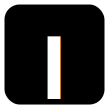

* **Factoring Fact-Checks: Structured Information Extraction from Fact-Checking Articles**  
Shan Jiang, Simon Baumgartner, Abe Ittycheriah and Cong Yu  
 In *Proceedings of the 2020 Web Conference (**WWW'20**)*, Taipei, Taiwan, Apr 2020  
\[ [paper](www20_paper.pdf){:target="_blank"} \| [bibtex](www20_bib.txt){:target="_blank"} \| [supplement](www20_supplement.pdf){:target="_blank"} \] acceptance rate: 217/1,129=19.2%

* **Reasoning about Political Bias in Content Moderation**  
Shan Jiang, Ronald E Robertson, and Christo Wilson  
 In *Proceedings of the 34th AAAI Conference on Artificial Intelligence (**AAAI'20**)*, New York, NY, USA, Feb 2020  
\[ [paper](aaai20_paper.pdf){:target="_blank"} \| [bibtex](aaai20_bib.txt){:target="_blank"} \| [data](../resources/#content-moderation){:target="_blank"} \| [code](https://github.com/printfoo/moderation-icwsm2019){:target="_blank"} \] invited to sister conference track: 16/16=100%

* **Bias Misperceived: The Role of Partisanship and Misinformation in YouTube Comment Moderation**  
Shan Jiang, Ronald E Robertson, and Christo Wilson  
 In *Proceedings of the 13th International AAAI Conference on Web and Social Media (**ICWSM'19**)*, Munich, Germany, Jun 2019  
\[ [paper](icwsm19_paper.pdf){:target="_blank"} \| [bibtex](icwsm19_bib.txt){:target="_blank"} \| [supplement](icwsm19_supplement.pdf){:target="_blank"} \| [data](../resources/#content-moderation){:target="_blank"} \| [code](https://github.com/printfoo/moderation-icwsm2019){:target="_blank"} \| [slides](icwsm19_slides.pptx){:target="_blank"} \] acceptance rate: 51/238=21.4%  
 **outstanding analysis paper: 1/238=0.4%**  

* **Crisis Sub-Events on Social Media: A Case Study of Wildfires**  
Shan Jiang, William Groves, Sam Anzaroot, and Alejandro (Alex) Jaimes  
 In *Proceedings of the AI for Social Good Workshop at the 36th International Conference on Machine Learning (**AISG**@ICML**'19**)*, Long Beach, CA, USA, Jun 2019  
\[ [paper](aisg19_paper.pdf){:target="_blank"} \| [bibtex](aisg19_bib.txt){:target="_blank"} \| [poster](aisg19_poster.pdf){:target="_blank"} \] oral presentation rate: 10/57=17.5%

* **Auditing Autocomplete: Suggestion Networks and Recursive Algorithm Interrogation**  
Ronald E Robertson, Shan Jiang, David Lazer, and Christo Wilson  
 In *Proceedings of the 11th International ACM Web Science Conference (**WebSci'19**)*, Boston, MA, USA, Jun 2019  
\[ [paper](websci19_paper.pdf){:target="_blank"} \| [bibtex](websci19_bib.txt){:target="_blank"} \] acceptance rate: 31/130=23.8%  

* **Auditing the Partisanship of Google Search Snippets**  
Desheng Hu, Shan Jiang, Ronald E Robertson, and Christo Wilson  
 In *Proceedings of the 2019 Web Conference (**WWW'19**)*, San Francisco, CA, USA, May 2019  
\[ [paper](www19_paper.pdf){:target="_blank"} \| [bibtex](www19_bib.txt){:target="_blank"} \] acceptance rate: 225/1,247=18.0%

* **Who’s the Guinea Pig? Investigating Online A/B/n Tests in-the-Wild**  
Shan Jiang, John Martin, and Christo Wilson  
 In *Proceedings of the 2019 ACM Conference on Fairness, Accountability, and Transparency (**FAT\*'19**)*, Atlanta, GA, USA, Jan 2019  
\[ [paper](fat19_paper.pdf){:target="_blank"} \| [bibtex](fat19_bib.txt){:target="_blank"} \| [code](https://github.com/printfoo/abtest-fat2019){:target="_blank"} \| [video](https://www.youtube.com/watch?v=ZxknxkHiIkM){:target="_blank"} \| [press](https://www.fastcompany.com/90306916/were-all-being-manipulated-by-a-b-testing-all-the-time){:target="_blank"} \] acceptance rate: 39/162=24.1%

* **Linguistic Signals under Misinformation and Fact-Checking: Evidence from User Comments on Social Media**  
Shan Jiang, and Christo Wilson  
 *Proceedings of the ACM: Human-Computer Interaction (**PACMHCI**)*, 2(CSCW), Nov 2018  
 Presented at *the 21st ACM Conference on Computer-Supported Cooperative Work and Social Computing (**CSCW'18**)*, Jersey City, NJ, USA, Nov 2018  
\[ [paper](cscw18a_paper.pdf){:target="_blank"} \| [bibtex](cscw18a_bib.txt){:target="_blank"} \| [blog](https://medium.com/acm-cscw/people-get-touchy-about-misinformation-and-about-the-truth-too-9930563d96d8){:target="_blank"} \| [data](../resources/#misinformation){:target="_blank"} \| [code](https://github.com/printfoo/misinfo-cscw2018){:target="_blank"} \| [slides](cscw18a_slides.pdf){:target="_blank"} \| [press](https://hopenothate.com/2018/10/21/extremism-is-on-the-ballot){:target="_blank"} \] acceptance rate: 185/722=25.6%

* **Auditing Partisan Audience Bias within Google Search**  
Ronald E Robertson, Shan Jiang, Kenneth Joseph, Lisa Friedland, David Lazer, and Christo Wilson  
 *Proceedings of the ACM: Human-Computer Interaction (**PACMHCI**)*, 2(CSCW), Nov 2018  
 Presented at *the 21st ACM Conference on Computer-Supported Cooperative Work and Social Computing (**CSCW'18**)*, Jersey City, NJ, USA, Nov 2018  
\[ [paper](cscw18b_paper.pdf){:target="_blank"} \| [bibtex](cscw18b_bib.txt){:target="_blank"} \| [supplement](cscw18b_supplement.pdf){:target="_blank"} \| [blog](https://medium.com/acm-cscw/is-it-the-algorithms-or-us-96d966aebbdb){:target="_blank"} \] acceptance rate: 185/722=25.6%  
 **honorable mention for best paper: 30/1,106=2.7%**  

* **Surge Pricing on a Service Platform under Spatial Spillovers: Evidence from Uber**  
Kyungmin (Brad) Lee, Marcus Bellamy, Nitin Joglekar, Shan Jiang, and Christo Wilson  
 Available at *SSRN*, Oct 2018  
 Abstract presented at *the 79th Annual Meeting of the Academy of Management (**AOM'19**)*, Boston, MA, USA, Aug 2019  
\[ [paper](ssrn18_paper.pdf){:target="_blank"} \| [bibtex](ssrn18_bib.txt){:target="_blank"} \| [ssrn](https://ssrn.com/abstract=3261811){:target="_blank"} \| [abstract](https://journals.aom.org/doi/abs/10.5465/AMBPP.2019.16279abstract){:target="_blank"} \]

* **On Ridesharing Competition and Accessibility: Evidence from Uber, Lyft, and Taxi**  
Shan Jiang, Le Chen, Alan Mislove, and Christo Wilson  
 In *Proceedings of the 2018 Web Conference (**WWW'18**)*, Lyon, France, Apr 2018  
\[ [paper](www18_paper.pdf){:target="_blank"} \| [bibtex](www18_bib.txt){:target="_blank"} \| [code](https://github.com/printfoo/ridesharing-www2018){:target="_blank"} \| [slides](www18_slides.pdf){:target="_blank"} \] acceptance rate: 171/1,155=14.8%

* **TNCs Today: A Profile of San Francisco Transportation Network Company Activity**  
Joe Castiglione, Tilly Chang, Drew Cooper, Jeff Hobson, Warren Logan, Eric Young, Billy Charlton, Christo Wilson, Alan Mislove, Le Chen, and Shan Jiang  
 *San Francisco County Transportation Authority Report*, Jun 2017  
\[ [paper](sfcta17_paper.pdf){:target="_blank"} \| [bibtex](sfcta17_bib.txt){:target="_blank"} \| [slides](sfcta17_slides.pdf){:target="_blank"} \| [visualization](https://tncstoday.sfcta.org){:target="_blank"} \]

* **Conflicts in Overlay Environments: Inefficient Equilibrium and Incentive Mechanism**  
Jianxin Liao, Jun Gong, Shan Jiang, Tonghong Li, and Jingyu Wang  
 *KSII Transactions on Internet and Information Systems (**TIIS**)*, 10(5), May 2016  
\[ [paper](tiis16_paper.pdf){:target="_blank"} \| [bibtex](tiis16_bib.txt){:target="_blank"} \]

* **Interactions among Overlays and Traffic Engineering: Equilibrium and Cooperation without Payment**  
Shan Jiang, Jun Gong, Jingyu Wang, Jianxin Liao, and Tonghong Li  
 In *Proceedings of the 2015 IEEE 58th Global Communications Conference (**GlobeCom'15**)*, San Diego, CA, USA, Dec 2015  
\[ [paper](globecom15_paper.pdf){:target="_blank"} \| [bibtex](globecom15_bib.txt){:target="_blank"} \] acceptance rate: 915/2,614=35.0%

* **Competitive Equilibrium and Stable Coalition in Overlay Environments**  
Shan Jiang, Jianxin Liao, Jun Gong, Jingyu Wang, and Tonghong Li  
 In *Proceedings of the 2015 IEEE 40th Conference on Local Computer Networks (**LCN'15**)*, Clearwater Beach, FL, USA, Oct 2015  
\[ [paper](lcn15_paper.pdf){:target="_blank"} \| [bibtex](lcn15_bib.txt){:target="_blank"} \] acceptance rate: 44/145=30.3%

* **Combination Feature for Image Retrieval in the Distributed Datacenter**   
Di Yang, Jianxin Liao, Qi Qi, Jingyu Wang, Haifeng Sun, and Shan Jiang  
 In *Proceedings of the 2014 IEEE 20th International Conference on Parallel and Distributed Systems (**ICPADS'14**)*, Hsinchu, Taiwan, Dec 2014  
\[ [paper](icpads14_paper.pdf){:target="_blank"} \| [bibtex](icpads14_bib.txt){:target="_blank"} \] acceptance rate: 96/322=29.8%

&nbsp;  
Rigorously peer-reviewed:  conference \|  journal  
Lightly peer-reviewed:  workshop \|  abstract  
Not peer-reviewed:  invited paper \|  report  
